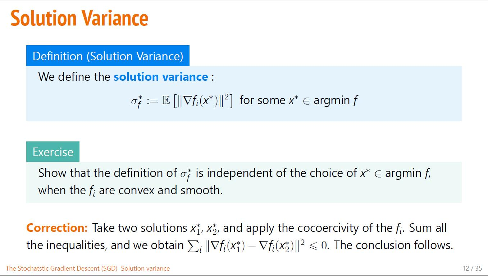
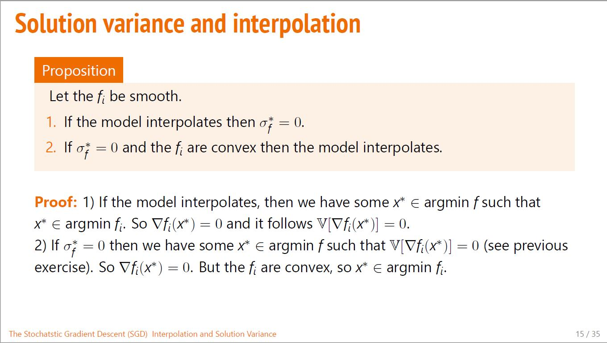
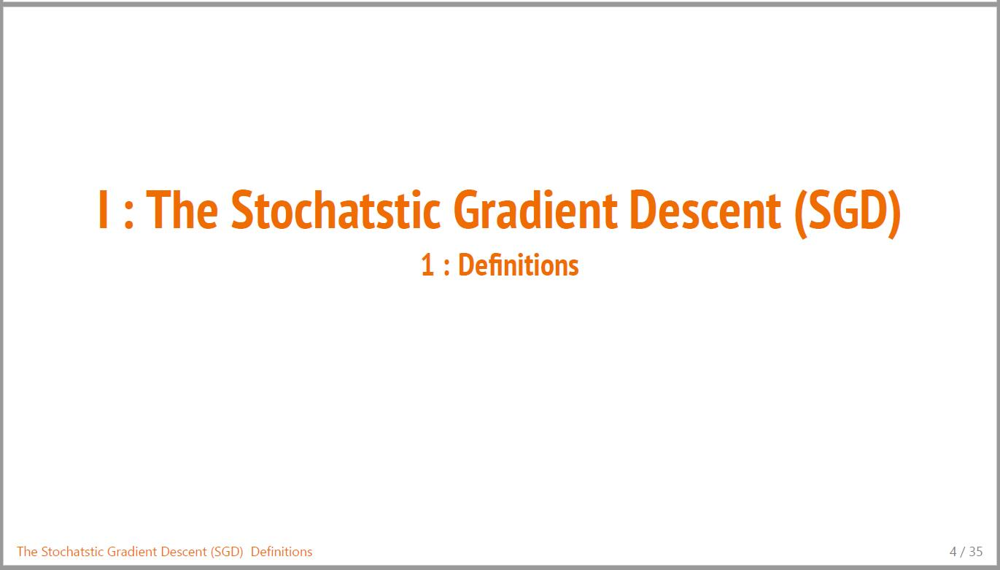
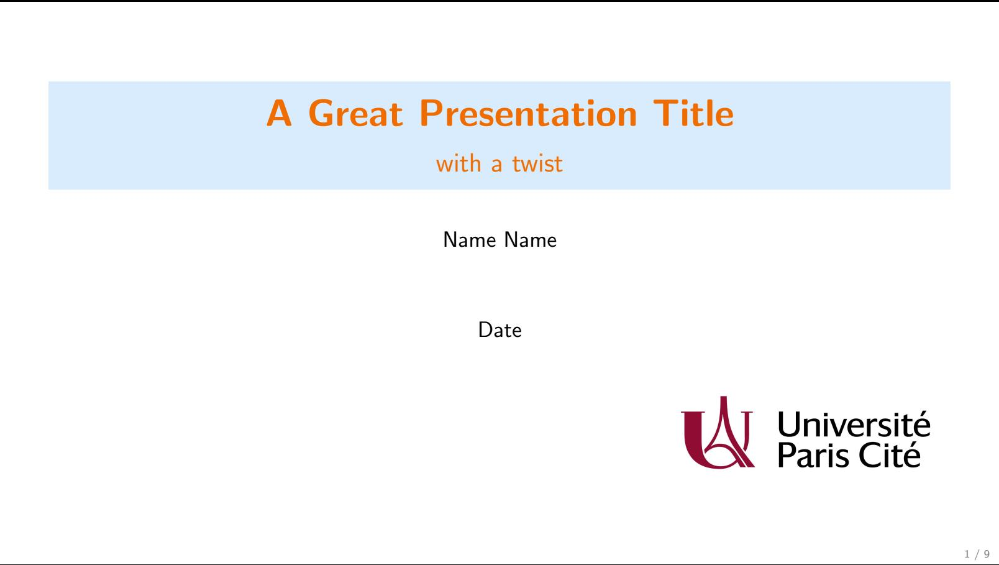
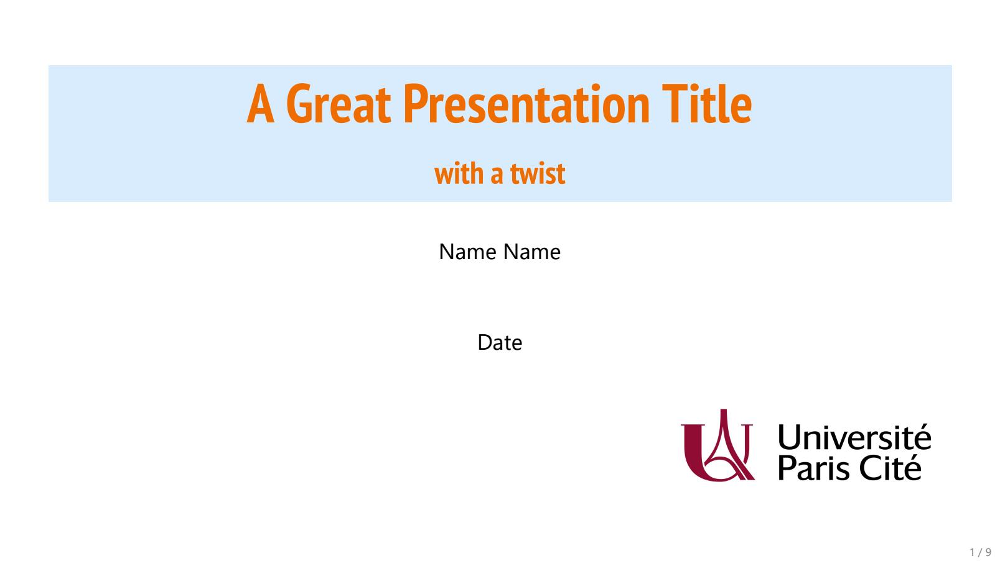

# Latex templates

Here I save and gather some templates I'm using to write LaTeX documents.

## Template for slides with beamer

### Overview

Here are some slides taken from a [grad course](https://guillaume-garrigos.com/M2optimization) I'm giving.

| Title | Definition / Examples | Theorems | Sections |
| :------------------------------------: | --------------------- | -------- | -------- |
|  |  |  |  |

I wrote this template during covid, as I had to give a lot of classes remotely. My goal was to have a unified color scheme (as usual blue for basic stuff, orange for important stuff, and green for side notes), while keeping the visuals as light as possible.

The goal was also to produce slides as fast as possible, and to have a syntax as close as possible to the one I use for textbooks and papers. For instance I just want to use environments like `\begin{theorem}` or `\begin{proof}` , and not have to deal with beamer-specific commands like `\begin{alertblock}`. I would say that I kinda succeeded, the only default of this template is that vertical spaces can sometimes be wacky (and it can [sometimes](https://tex.stackexchange.com/questions/615437/vertical-spacing-between-equation-and-itemize-environments) be a complicated topic!).

### Install

You will need the main style file `vinassan.sty` and the color file `color.sty` in the same folder. Then use 

```
\usepackage{vinassan}
```

at the beginning of your latex file.

In practice I fancy using specific fonts for my slides. If you want to use the same fonts as me, you need to install them (once and for all) on your computer, and to compile your documents using XeTeX instead of PdfLaTeX. If you wonder what is the difference between standard fonts and my fonts, here it is:

|            Basic fonts            | Special fonts                     |
| :-------------------------------: | --------------------------------- |
|  |  |

The two fonts I am using are `PT Sans Narrow Bold` (for the titles, which are used in Google Slides) and `Segoe UI` (for the main body). You need to download them, and add them to your OS (usually just put the .tff in the font folder of you OS). Then you are good to go!

### Usage

You can look at `_assets\slides\demo_beamer.tex` for an example of how to use the template.
