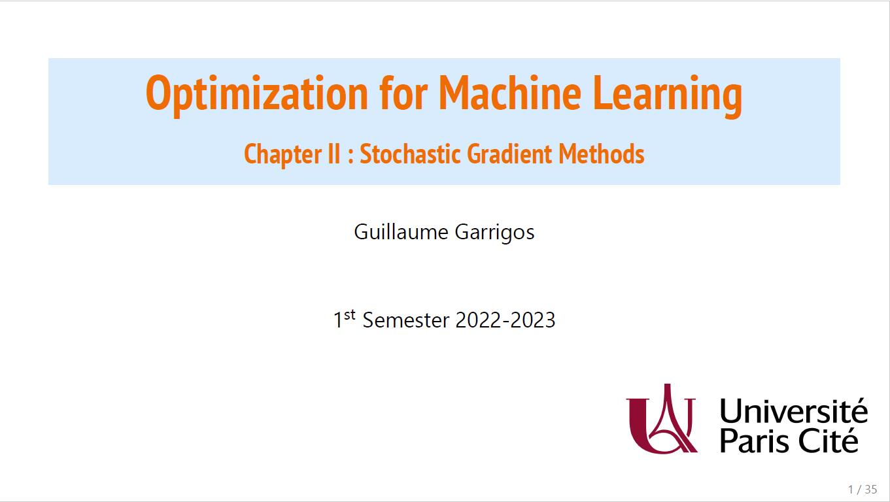
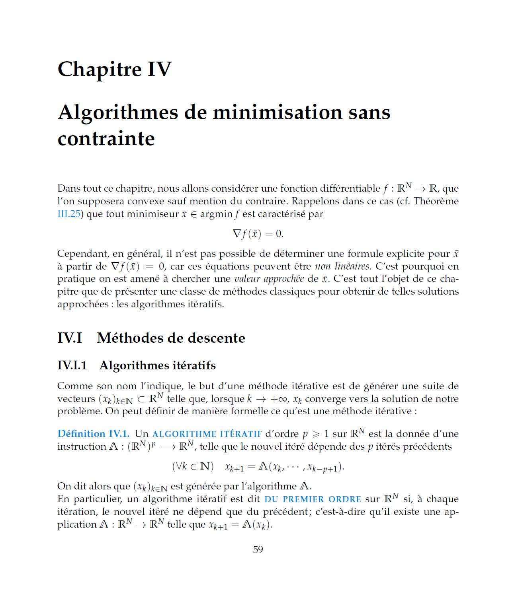

# Latex templates

Here I save and gather some templates I'm using to write LaTeX documents. You are free to reuse them as you wish, I would just ask you to leave a link towards this repository to be in your source code.

- [Template for slides with beamer](#Template-for-slides-with-beamer)
- [Templates for exercises](#Templates-for-exercises)
- [Template for book](#Template-for-book)
- [Macros for writing LaTeX outside of LaTeX](#Macros-for-writing-LaTeX-outside-of-LaTeX)
- [Template for poster](#Template-for-poster)

## Template for slides with beamer

### Overview

Here are some slides taken from a [grad course](https://guillaume-garrigos.com/M2optimization) I'm giving.

| Title | Definition / Examples | Theorems | Sections |
| :------------------------------------: | --------------------- | -------- | -------- |
|  |  |  |  |

I wrote this template during covid, as I had to give a lot of classes remotely. My goal was to have a unified color scheme (as usual blue for basic stuff, orange for important stuff, and green for side notes), while keeping the visuals as light as possible.

The goal was also to produce slides as fast as possible, and to have a syntax as close as possible to the one I use for textbooks and papers. For instance I just want to use environments like `\begin{theorem}` or `\begin{proof}` , and not have to deal with beamer-specific commands like `\begin{alertblock}`. I would say that I kinda succeeded, the only default of this template is that vertical spaces can sometimes be wacky (and it can [sometimes](https://tex.stackexchange.com/questions/615437/vertical-spacing-between-equation-and-itemize-environments) be a complicated topic!).

### Install

You will need the main style file `vinassan.sty` and the color file `color.sty` in the same folder. Then use 

```
\usepackage{vinassan}
```

at the beginning of your latex file.

In practice I fancy using specific fonts for my slides. If you want to use the same fonts as me, you need to install them (once and for all) on your computer, and to compile your documents using XeTeX instead of PdfLaTeX. If you wonder what is the difference between standard fonts and my fonts, here it is:

|            Basic fonts            | Special fonts                     |
| :-------------------------------: | --------------------------------- |
|  |  |

The two fonts I am using are `PT Sans Narrow Bold` (for the titles, which are used in Google Slides) and `Segoe UI` (for the main body). You need to download them, and add them to your OS (usually just put the .tff in the font folder of you OS). Then you are good to go!

### Usage

You can look at `assets\slides\demo_beamer.tex` for an example of how to use the template.

## Templates for exercises

### Overview

This template contains the logo of my university, allows to include titles for exercises.

|              Overview              |              Correction              |              Grades              |
| :--------------------------------: | :----------------------------------: | :------------------------------: |
|  |  |  |

### Install

You just need the `TD.sty` file, together with `colors.sty`. You'll need to modify `TD.sty` to tell it where is `color.sty` and where is the logo you wanna use.

### Usage

Optionally allows to indicate grades in the margin, can be activated with `\notetrue` in the preamble (needs two compilations in a row to work properly). Option to write correction with the  `\begin{correction}` environment, hidden by default but can be activated with `\correctiontrue` in the preamble.

See `assets\slides\demo_exercises.tex` for a detailed example.

## Template for book

### Overview

|  |  |
| :--------------------------: | ---------------------------- |

Template which I used to write notes for my undergrad optimization class.

### Install

See `poly.sty`

## Macros for writing LaTeX outside of LaTeX

| Macro Overview (slightly slowed down) |
| ------------------------------------- |
|            |

Originally I only typed latex within a specific Latex program (texmaker in my case), where I had some macros (say `\R` as a macro for `\mathbb{R}`). Problem is that I started to need to write Latex in other places, such as in mails, in stackexchange, or while taking notes in Markdown.

The solution for me was to define macros at the OS level, and on Windows I'm using AutoHotKeys.

The script `latex_macro.ahk` contains a bunch of basic macros such as "if I type `\RR` replace it with `\mathbb{R}`", but also more advanced ones :

- brackets with autocompletion, e.g. `\left(  \right)`
- Comment/Uncomment many selected lines at once with Alt+T / Alt+U (to mimic Texmaker functionality in Overleaf for instance)
- Replace `F1` with `Ctrl+Enter` to compile in Texmaker (to mimic Overleaf)

## Template for poster

### Overview

|  |
| ----------------------------- |

I adapted a template from Inria by making it more colorful.

### Install 

Use `colorposter.sty`. You can see the code of the above poster in `assets/poster/poster.tex`.

### Usage

I have a couple customs commands to make life easier

- A ``begin{colorblock}[backgroundcolor=.]` environment for the big colored blocks
- A ``begin{colorframe}[backgroundcolor=.,linecolor=.]` environment for the frames with border and possibliy different background

